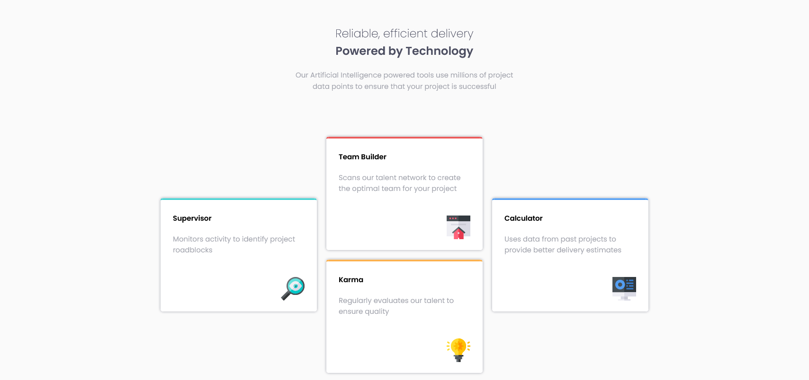

# Frontend Mentor - Four card feature section solution

This is a solution to the [Four card feature section challenge on Frontend Mentor](https://www.frontendmentor.io/challenges/four-card-feature-section-weK1eFYK). Frontend Mentor challenges help you improve your coding skills by building realistic projects. 

## Table of contents

- [Frontend Mentor - Four card feature section solution](#frontend-mentor---four-card-feature-section-solution)
  - [Table of contents](#table-of-contents)
  - [Overview](#overview)
    - [The challenge](#the-challenge)
    - [Screenshots](#screenshots)
      - [Desktop Screenshot](#desktop-screenshot)
    - [Links](#links)
  - [My process](#my-process)
    - [Built with](#built-with)
    - [What I learned](#what-i-learned)
    - [Continued development](#continued-development)
    - [Useful resources](#useful-resources)
  - [Author](#author)

## Overview

### The challenge

Users should be able to:

- View the optimal layout for the site depending on their device's screen size

### Screenshots

#### Desktop Screenshot

### Links

- Solution URL: [https://github.com/jandrev/four-card-feature-section](https://github.com/jandrev/four-card-feature-section)
- Live Site URL: [https://four-card-feature-jandrev.netlify.app/](https://four-card-feature-jandrev.netlify.app/)

## My process

### Built with

- Semantic HTML5 markup
- CSS custom properties
- Flexbox
- CSS Grid

### What I learned

I reinforced my CSS basics and went a little bit deeper. This time, I learnt how to use the CSS grid on a basic level and how to create basic responsive designs.

### Continued development

I will focus on CSS layout techniques in future projects as layout was especially tricky for me as a beginner. Besides that, I should also focus on creating responsive designs. This aspect was especially difficult for me in this project, so I expect to work on this as well in future projects.

### Useful resources

- [MDN Web Docs](https://developer.mozilla.org/en-US/)) - It has a very thorough CSS documentation, which proved to be very useful when researching how to solve the styling problems of the project.

## Author

- Frontend Mentor - [@jandrev](https://www.frontendmentor.io/profile/jandrev)